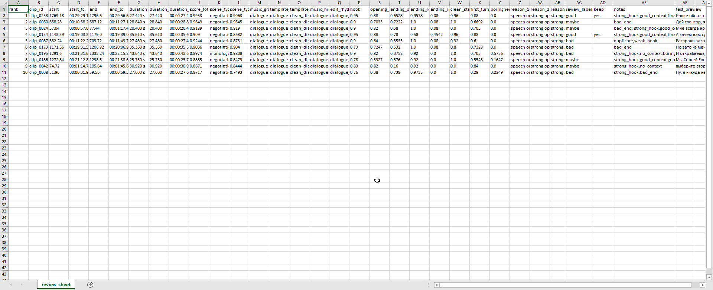
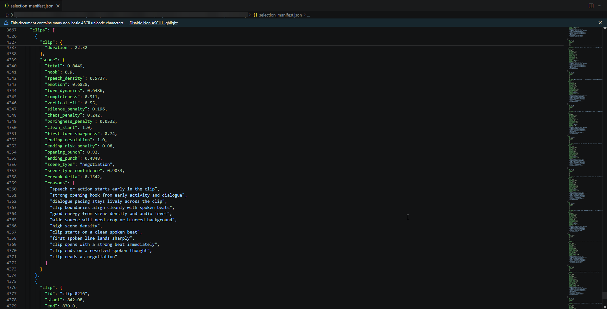
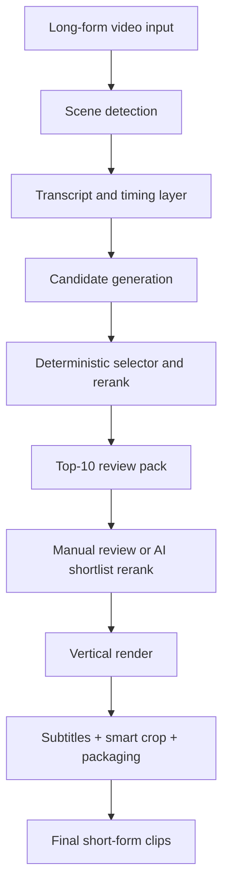

# Shorts Foundry

A private-code, public-showcase project for turning long-form TV and film material into ranked short-form clip candidates and vertical social-ready outputs.

This repository is a **Black Box Showcase** for Shorts Foundry: it documents the product, architecture, workflow, and validation process without exposing proprietary code or copyrighted source media.

## What Problem It Solves
Editing short-form highlights from long-form content is slow, repetitive, and hard to scale.

This system was built to reduce the manual work behind:
- finding strong highlight candidates;
- turning them into 9:16 vertical clips;
- adding readable animated subtitles;
- applying crop, packaging, and optional music consistently;
- keeping a review loop so a human can still make the final call.

## What The System Does
At a high level, the pipeline:
1. detects scenes and speech-dense windows;
2. ranks highlight candidates with a deterministic selector;
3. exports `top-10` review artifacts for human triage;
4. renders approved clips into vertical outputs with subtitles and smart crop;
5. supports packaging hints such as music/template grouping.

## Showcase Positioning
This is not a generic AI toy project.
It is a working orchestration system designed around real production tradeoffs:
- deterministic baseline first;
- human-in-the-loop review where taste matters;
- AI used where it adds leverage, not where it makes the system fragile;
- repeatable operation across multiple episodes and source profiles.

## Demo

https://www.youtube.com/watch?v=0P_CoSDtcVc

**Performance metrics for the first 10 days:**

**Review sheet:**

**Selection audit:**

Asset locations inside this repo:
- `media/screenshots/`

## High-Level Architecture

A more detailed version is in [docs/ARCHITECTURE.md](./docs/ARCHITECTURE.md).

## System Highlights
- Deterministic selector with rerank, hook/ending/boringness signals, and overlap guards.
- Review-first workflow built around `top-10`, not blind trust in `top-3`.
- Hybrid subtitle layer combining better transcript quality with local timing alignment.
- Smart crop with face-based framing and motion smoothing.
- Packaging layer with template switching and optional music-bed logic.
- Review calibration workflow for improving selector behavior from human labels.

## AI-Native Engineering Angle
This project reflects AI-native orchestration, not just model usage.

The engineering work focuses on:
- composing multiple AI and non-AI subsystems into one pipeline;
- choosing where deterministic logic beats model judgment;
- using human review as a first-class system component;
- iterating on heuristics with audit artifacts and calibration data.

Core stack and integrations are summarized in [docs/RESULTS_AND_VALIDATION.md](./docs/RESULTS_AND_VALIDATION.md).

## Validation Scope
The private development version was exercised on a mixed internal batch of long-form assets, including:
- multi-episode drama/dialogue-heavy material;
- shorter comedy material;
- multiple selector-only audit cycles;
- manual review sheets used to calibrate selection quality.

The public repo does not include the source media or private outputs, but the workflow and artifacts are documented.

## Current Product Status
Current maturity:
- selector baseline: usable and review-oriented;
- subtitle layer: strong working V1;
- smart crop: usable V1;
- packaging/template switching: working but still evolving;
- review calibration: started and already useful.

See [docs/RESULTS_AND_VALIDATION.md](./docs/RESULTS_AND_VALIDATION.md) and [docs/ROADMAP.md](./docs/ROADMAP.md).

## Repo Map
- [docs/ARCHITECTURE.md](./docs/ARCHITECTURE.md) - system architecture and data flow
- [docs/RESULTS_AND_VALIDATION.md](./docs/RESULTS_AND_VALIDATION.md) - current capabilities and how the system was tested
- [docs/PRIVATE_CODE_POLICY.md](./docs/PRIVATE_CODE_POLICY.md) - why this repo is docs-only
- [docs/ROADMAP.md](./docs/ROADMAP.md) - next product steps

## Private Code Note
This public repository intentionally excludes:
- source code;
- private configuration;
- copyrighted source videos;
- generated outputs tied to non-public media.

If needed for interviews, the implementation can be discussed through:
- architecture walkthroughs;
- design tradeoff discussions;
- sanitized artifact reviews;
- live explanation of the orchestration model.

## Contact
Replace before publishing:
- Name: `[your name]`
- Email: `[your email]`
- LinkedIn: `[your profile]`
- Portfolio: `[your link]`
