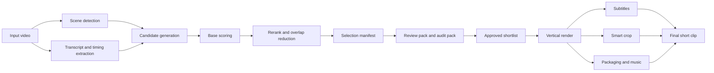

# Architecture

## Design Goal
Build a reusable orchestration pipeline that can turn long-form source material into strong short-form candidates without relying on a fully opaque model-driven selector.

## Core Design Principles
- Deterministic baseline first.
- Human review remains part of the product, not a fallback.
- AI is used selectively where it creates leverage.
- Transferability across episodes matters more than overfitting one source file.

## End-to-End Flow

## Major Layers
### 1. Selector
The selector is built as a staged ranking system:
- scene detection;
- transcript-driven candidate generation;
- base scoring;
- rerank with additional signals;
- overlap reduction;
- review-oriented shortlist generation.

Key selector ideas:
- strong openings matter;
- endings matter even more than they look on paper;
- boring but structurally clean clips should be penalized;
- multiple near-duplicate moments from one dialogue block should be suppressed.

### 2. Review Layer
The system is intentionally designed around `top-10` review artifacts.

Why:
- some clips look good in metrics but feel weak in practice;
- some clips feel strong even when a deterministic score undershoots them;
- final taste and editorial judgment should remain recoverable.

Artifacts:
- selection manifests;
- review sheets;
- audit sheets;
- calibration reports from labeled reviews.

### 3. Subtitle Layer
The subtitle system is not just a transcript dump.
It includes:
- animated subtitle presentation;
- hybrid text/timing logic;
- boundary fixes;
- segment-aware chunking;
- short-form readability rules.

### 4. Smart Crop Layer
The crop layer supports:
- active area framing;
- face-based crop;
- fallback behavior;
- motion smoothing.

### 5. Packaging Layer
The packaging layer can influence:
- subtitle treatment;
- lightweight template switching;
- music grouping;
- render-time presentation hints.

## Why Not Just Use One LLM For Everything?
The project intentionally avoids a fully LLM-driven core selector because:
- deterministic auditability is valuable;
- cost and repeatability matter;
- manual review works better when the candidate pool is stable;
- some failures are boundary problems, not semantic-understanding problems.

## Where AI Helps Most
The system is better served by AI in targeted roles:
- transcript quality;
- shortlist rerank;
- review assistance;
- optional packaging decisions.

That is more reliable than pushing all editorial taste into a single opaque score.
